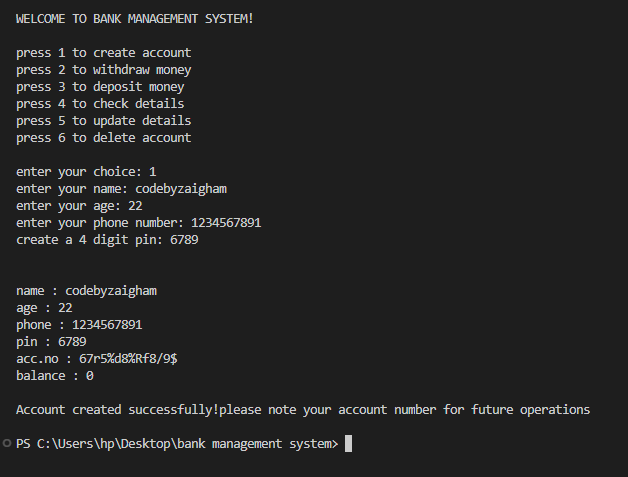
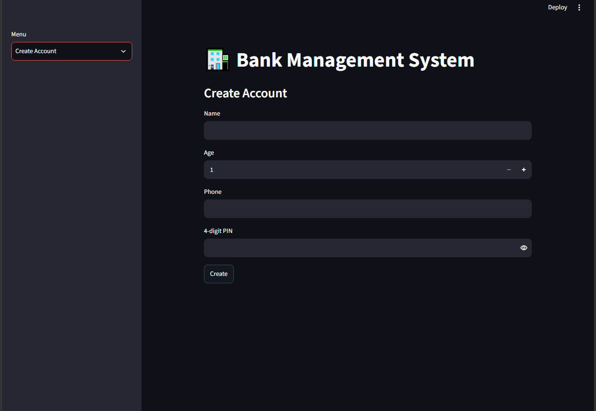

# 🏦 Bank Management System (CLI + Web App)

A **fully functional Bank Management System** built using **Python (OOP)** with two interfaces:

- 💻 **CLI Version** (Terminal-based)
- 🌐 **Web App Version** using Streamlit

This project demonstrates **core software engineering principles**, including:
- Object-Oriented Programming (OOP)
- File-based database handling (JSON)
- Modular design
- User authentication (PIN-based)
- CRUD operations

---

## 🚀 Features

### 👤 Account Management
- Create new bank account
- Auto-generate unique account number
- Secure PIN-based access

### 💰 Transactions
- Deposit money
- Withdraw money
- Balance validation

### 📄 User Operations
- View account details
- Update personal information
- Delete account

### 🌐 Web Interface (Streamlit)
- Clean and interactive UI
- Sidebar navigation
- Real-time operations

---

## 🛠️ Tech Stack

- **Language:** Python 3.10+
- **Frontend (Web):** Streamlit
- **Database:** JSON (file-based)
- **Concepts:** OOP, File Handling

---

## 📂 Project Structure

bank-management-system/
│
├── app.py # Streamlit Web App
├── main.py # CLI Version
├── data.json # Database file
├── requirements.txt # Dependencies
└── README.md

---

## ⚙️ Installation & Setup

### 1️⃣ Clone Repository

- git clone https://github.com/CodeByZaigham/PyLedger-System

### 2️⃣ Create Virtual Environment (Recommended)

- python -m venv venv
- venv\Scripts\activate   # Windows

### 3️⃣ Install Dependencies
- pip install -r requirements.txt

### ▶️ Run the Application
- 💻 CLI Version
- python main.py

### 🌐 Web App (Streamlit)
- streamlit run app.py

---

## 🔐 Data Storage
- All data is stored in data.json
- No external database required
- Lightweight and beginner-friendly

### 🧠 Learning Outcomes

This project helped in understanding:

Designing real-world systems using OOP
Handling persistent data with JSON
Building interactive web apps with Streamlit
Structuring scalable Python projects

### 🔥 Future Improvements
- 🔐 Password hashing (security enhancement)
- 🗄️ Migration to SQLite / PostgreSQL
- 📊 Transaction history tracking
- 🌍 Deployment (Streamlit Cloud / Render)
- 🔑 User authentication system

## 📸 Screenshots

## 🤝 Contributing

Contributions are welcome!

Fork the repo
Create your branch (git checkout -b feature-name)
Commit changes
Push and create a PR

### 📜 License

- This project is licensed under the MIT License

👨‍💻 Author

CodeByZaigham

GitHub: https://github.com/CodeByZaigham
LinkedIn: https://www.linkedin.com/in/codebyzaigham/
⭐ Show Your Support

If you like this project:

⭐ Star this repo
🍴 Fork it
📢 Share it

🚀 Built with passion to learn and grow in software development